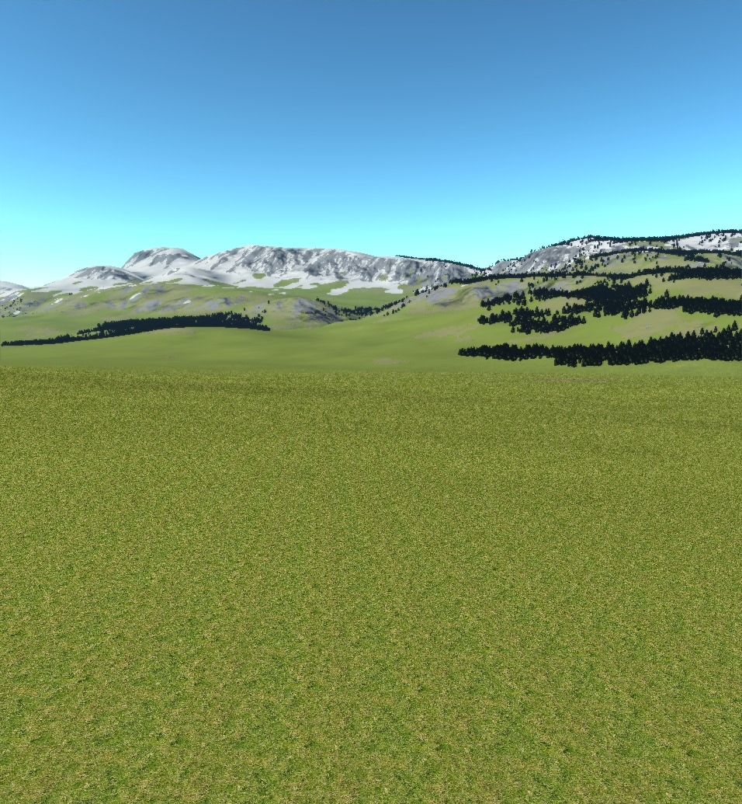
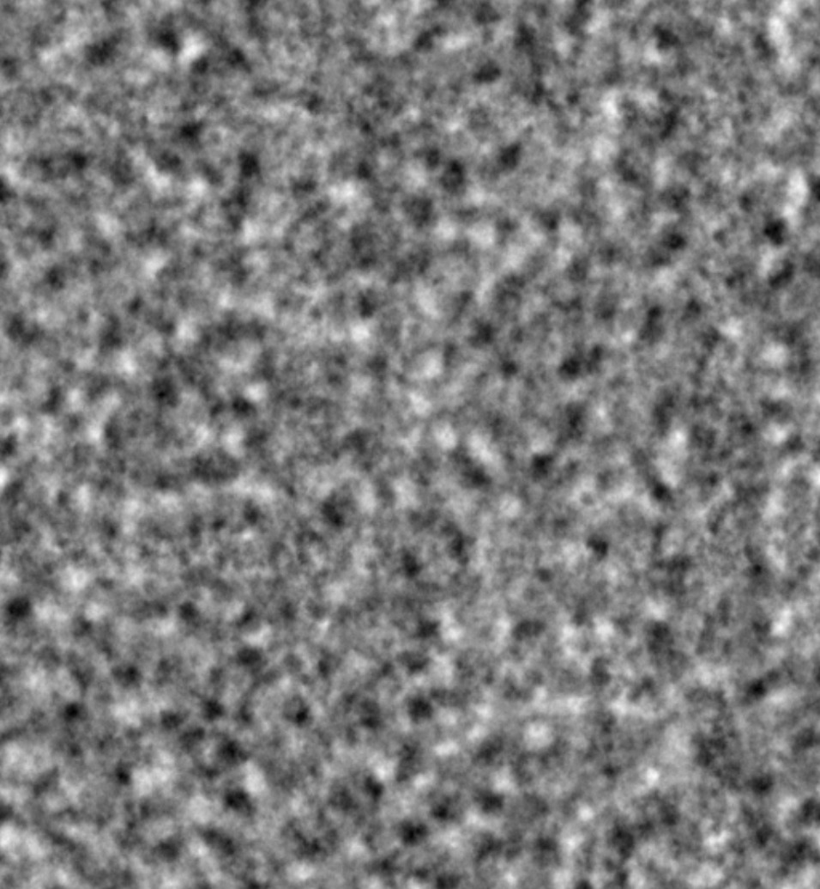
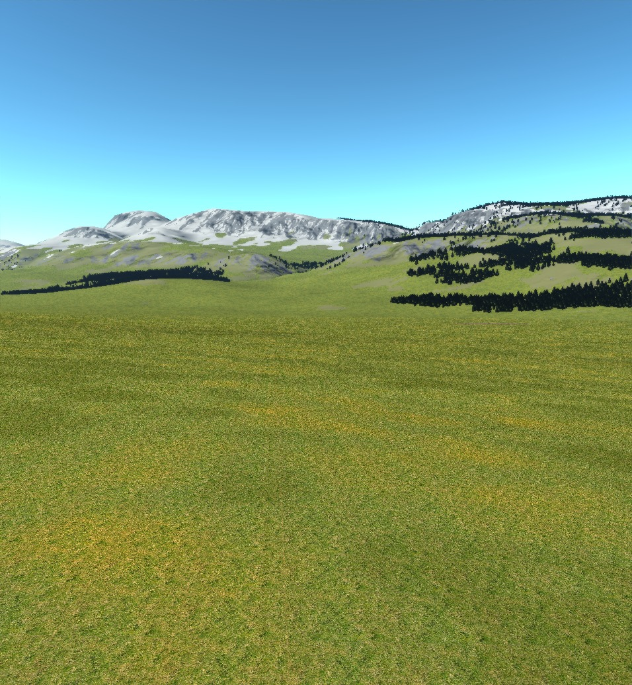
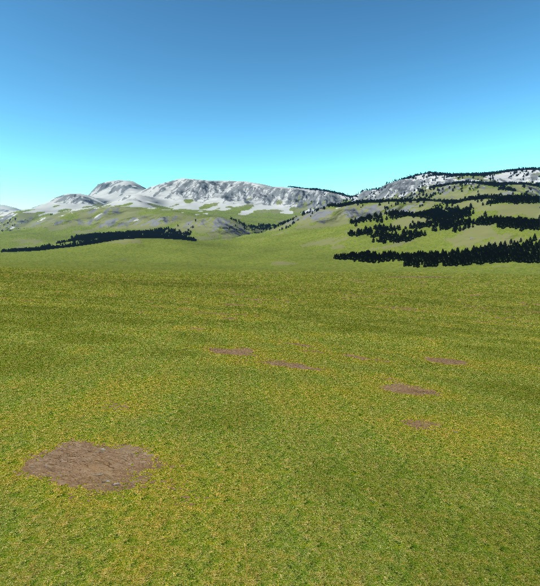
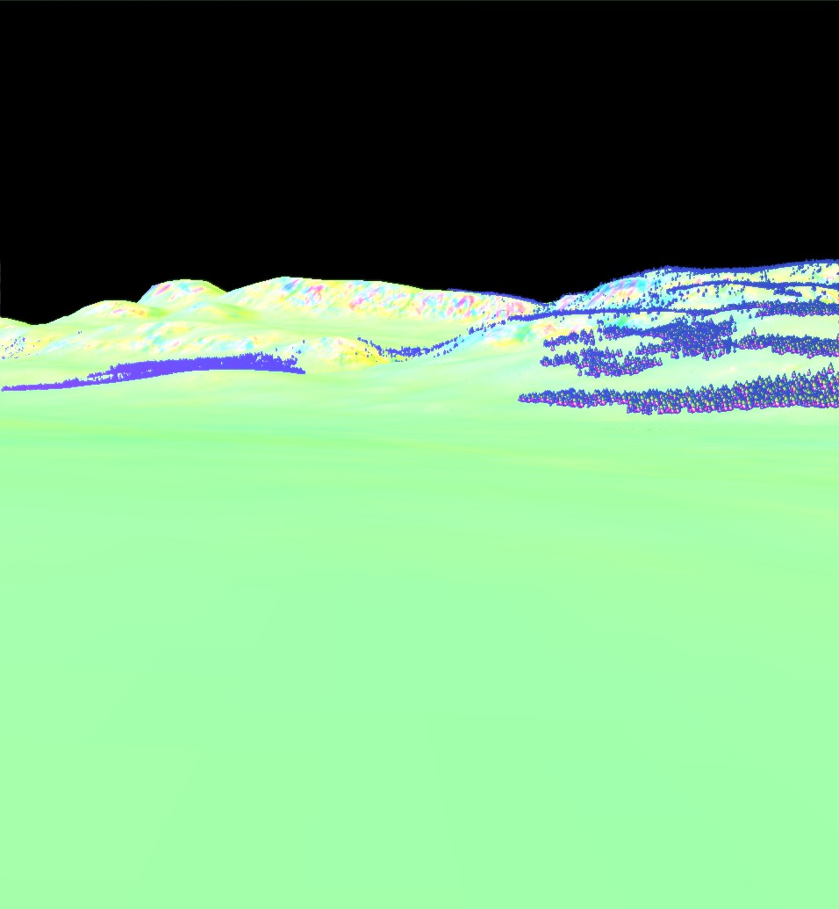
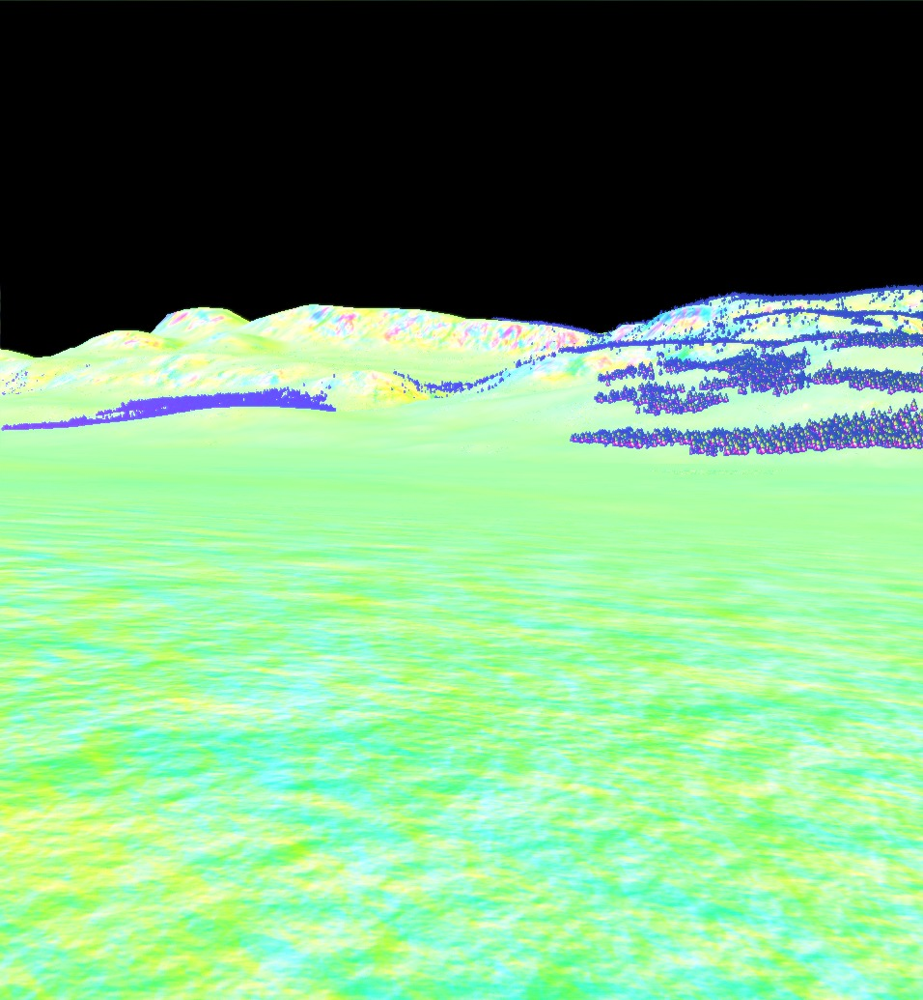
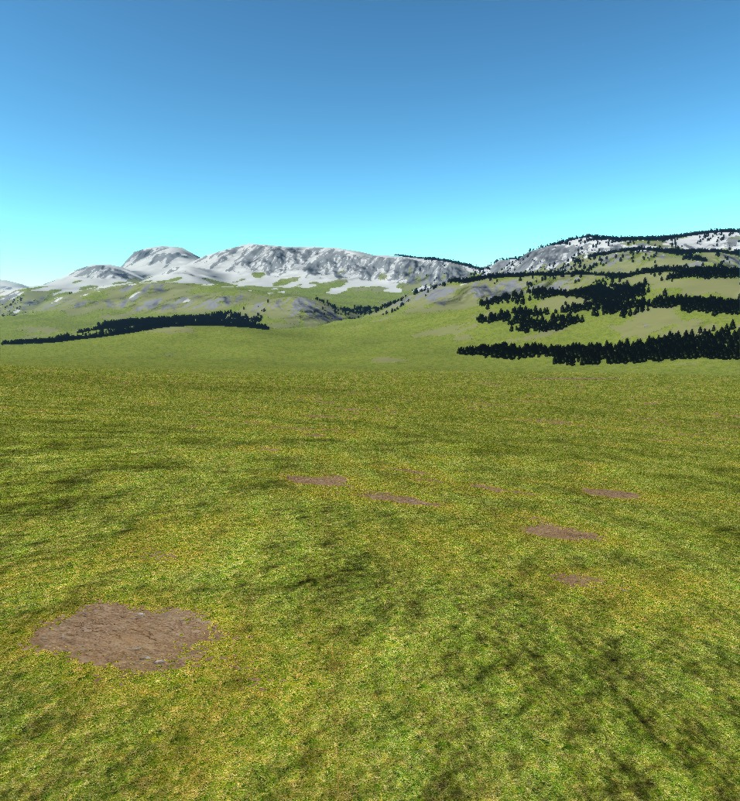
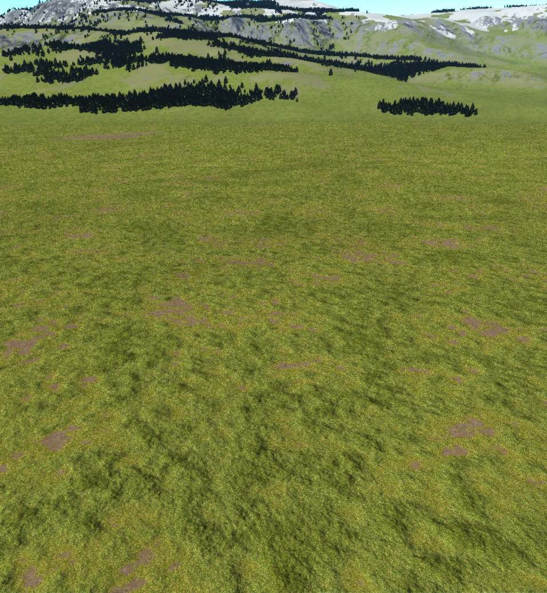
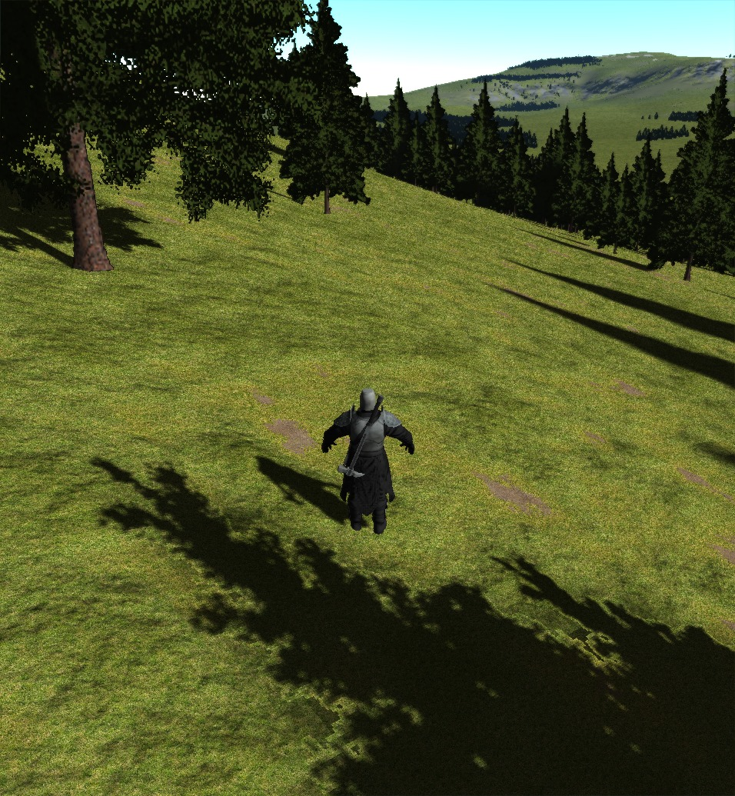
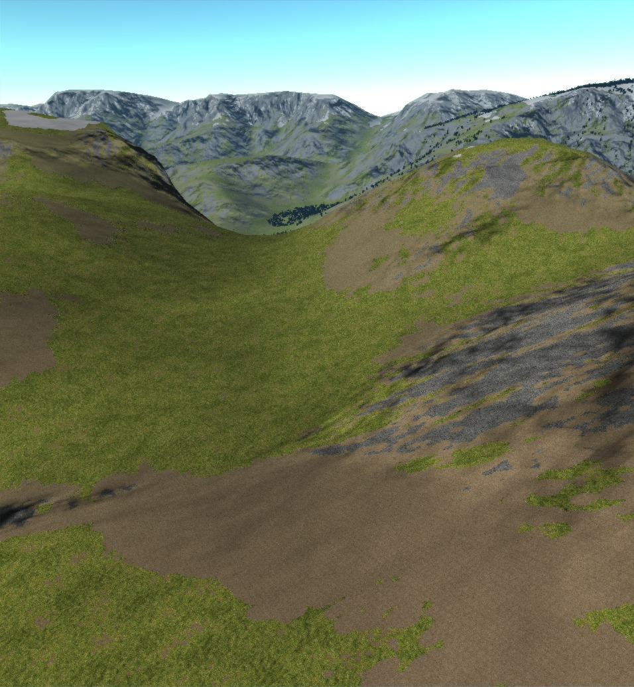

## Bumpy Grass

It seems that when one writes things about procedural content (or rendering things procedurally) it is a rite of passage to write an article about fractal noise: what it is, how to generate it, etc.

This I will not do.

Instead I will write a short piece on _using_ fractal noise.  Naturally I use fractal noise all over the place for the heightmap etc, but one of the more recent additions has been to the grass rendering.

I will admit I was inspired by [this Outerra blogpost](http://outerra.blogspot.co.za/2011/05/bumpy-grass-effect.html) for this.  If you don't know, Outerra is a planet simulator that puts my small project to shame.  But as such it serves as a good source of inspiration.

This is the problem:

This is a general scene from within one of the valleys.  The far detail is decent.  There are definitely mountains and interesting forests.  However the foreground is a dismal, flat, homogenous mess.  There is no sense of depth for the first couple of hundred meters.

The solution is smart modulation of the ground with some noise.  For reference, this is the noise we shall use.  It is a tilable fractal noise of 10 octaves with persistance 0.5.  All the values are within (and fill) the range -1 to 1.

The first step is to define the "dryness" of the ground.  This will in turn decide the grass color.  Dryer grass will be yellower and wetter grass darker.  Something like

~~~ c++
float get_ground_dryness(vec2 pos)
{
  return texture(noisemap, pos/50).a;
}
~~~

However, this adds a problem at a slightly larger scale.  Now every 50 meters will look identical.  The solution is to add a much larger octave.  I also add a smaller one, just to give a little more small-scale variation.

~~~ c++
float get_ground_dryness(vec2 pos)
{
  return clamp(
    (texture(noisemap,pos/50).a +
     texture(noisemap,pos).a*0.2 +
     texture(noisemap,pos/300).a)/1.2,
    -1, 1);
}
~~~

Note that the periods, 50 and 320 are "quite relatively prime" in the sence that `gcd(50, 320) = 10` is relatively small.  There are reasons why its not really worth making it completely relatively prime (by using 317 for example) that I shan't go into right now.

Coloring the dryer areas as described gives us the following affect.  Its a slight improvement, but its very obvious what we've done, and there are still some repeated texture artifacts (such as the rows of dark spots in the middle of the image).

One way to break up the monotonous grass is to just make very very dry areas dirt.

This helps somewhat break up the grass monotony, but we still have the artifacts.  Moreover, the entire thing looks so _flat_.  This is where the Outerra blogpost gives an idea.  According that post, 

> The effect is most visible when the sun is lower, it's achieved just by normal lighting.

At first I wasn't convinced and thought there had to be some geometry displacement, but it turns out that you _can_ get some rather good results just by messing with the normals.  For reference, this is what the normals in the scene look like right now.  In my coordinate system, `y` (green) is up.

I decided on a very simple approach for calculating normals.  I'd construct a heightmap and then calculate the normals off this at rendertime.  The function for this is quite simple

~~~ c++
vec3 get_normal_from_heightmap(vec2 pos)
{
  vec3 v1 = vec3(pos.x     , grass_heightmap(pos)              , pos.y);
  vec3 v2 = vec3(pos.x+0.01, grass_heightmap(pos+vec2(0.01, 0)), pos.y);
  vec3 v3 = vec3(pos.x     , grass_heightmap(pos+vec2(0, 0.01)), pos.y+0.01);
  return normalize(cross(v3-v1 ,v2-v1));
}
~~~

Now all that remains is to define the hightmap.  This I found to be a real hit and miss operation, but with a bit of intuinting and a lot of testing I found a function that works sufficiently well.

~~~ c++
float grass_height_displacement(vec2 pos)
{
  float f = (1+clamp(texture(noisemap,pos/6).a, -1.0, 0.7))/1.7
                   + texture(noisemap,pos/50).a*5;
                   + texture(noisemap,pos/100).a*10;
  return f*0.05;
}
~~~

If we use this directly, we get the following normal output.

Last thing to do is to modulate by the grass dryness again.  This time, wetter areas will be more bumpy and dryer areas will be flatter.  This is just a matter of scaling the heightmap in `get_normal_from_heightmap` by a suitable function of the dryness.  I found `clamp(getGroundDryness(pos)+0.8,0,1)` to work well. Plugging this into the rendering pipeline gives us the finished product.

This is a _substantial_ improvement over where we started.   There are a lot of things I'd like to tweak though.  The shadows look very dark to me for example.  Also, I'm not convinced of the shape of the noise.  However, these are minor things that can be worked on and worked on and will never be perfect.

To close, here are some more images of the new grass.

