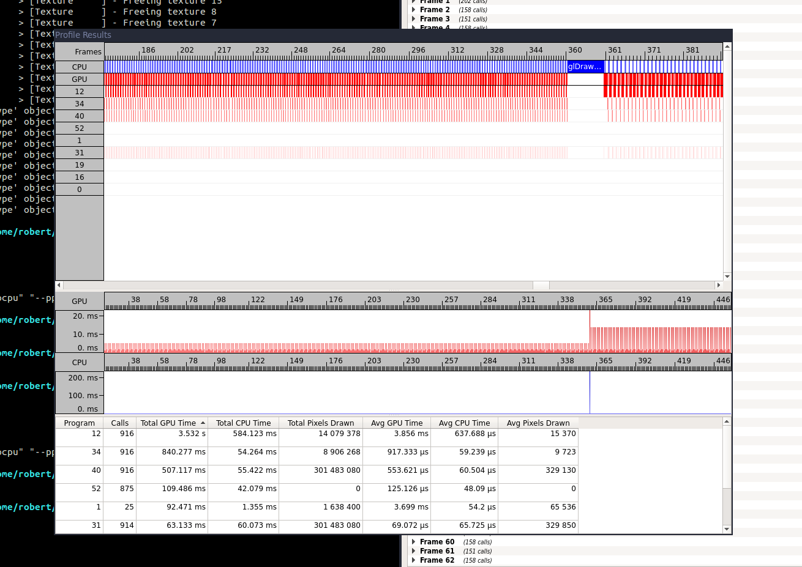

## Buffer Usage Hints (are more than just hints)

Playing around with rendering tree billboards (and trying to push the number of trees as high as possible), I ran into a curious problem.

After 360 frames, the time to render the trees jumped from 5ms to 13ms.

A little background:
 * The trees are instanced using `glDrawElementsInstancedBase`.
 * The instance data is a model matrix per tree, generated by a transform feedback system.
 * I was only generating the instance data at the program start.

I'd stripped out all the other bits of the system so I was only rendering the trees.  Finding what caused the slowdown took a while but the short answer is that I defined the buffer usage hint on the instance buffer incorrectly.

These hints are the values `GL_STREAM_DRAW`, `GL_STATIC_READ`, `GL_DYNAMIC_COPY` etc. used in [`glBufferData`](http://docs.gl/gl4/glBufferData).  They are hints to the drivers as to how you want to use your data.

For example, `DYNAMIC` means you will read and write often, `STREAM` means you will write once and read very few times and `STATIC` means that you will write once and read many times.

I had used `GL_STATIC_READ`, as I had been following a tutorial in which the results of the transform feedback were read back to the CPU.  However, in the game, the results were to stay on the GPU to be used as instance data.

What was occuring was at about frame 360, the driver was packing up the data and putting it somewhere else in the GPU memory.  I know this because the memory footprint of my program changed (downwards) at that point.  Presumably this was to allow any `DRAW` buffers I might declare to have faster access.

Simply changing the type to `GL_STATIC_DRAW` prevented this from happening and I got a 5ms render forever.  So learn from my mistakes and always give correct hints.
